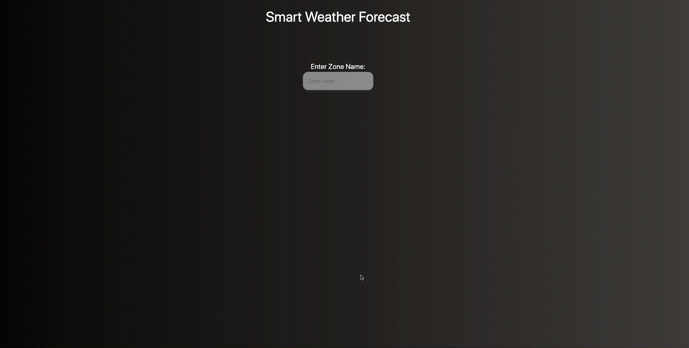

## Умный сервис прогноза погоды 
## Тестовое задание в "Школу Будущих СТО Яндекс.Облака"

*Задача со звездочкой*

- **Используемый язык**: Python3, aiohttp
- **Пользовательский интерфейс**: React app
- **Форма ответа**: JSON
    - **Пример**:
      См. https://github.com/Ruslan2702/smart_weather/blob/master/smart_weather_backend/smart_weather/api/schema/smart_weather.yaml#L13

- **Демонстрация**

    

- **Процесс работы программы**

- **Как запустить**
